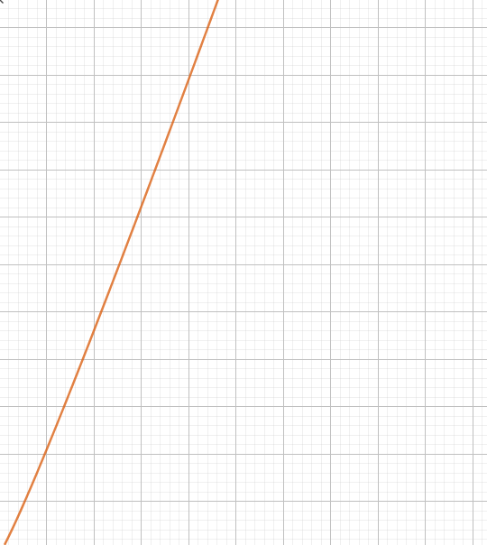
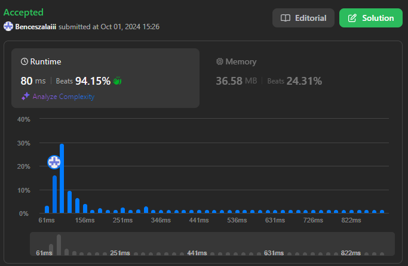

# Prime-cs

A prime generating/counting program that uses Sieve of Eratosthenes

## Big O Notations

### - Time Complexity: O(N*log(Log(N)))



### - Space Complexity: O(N)

## LeetCode results



## How it works

### 1. Get input

   - `tol` : The first number to check
   - `ig` : The last number to check

### 2. Set up the array

We initialize an array (list) of booleans, where the default value is true

`[true, true, true, true, true]` for example

The length of this array should equal `ig`

Set index 0 and 1 to `false`, since neither 0 nor 1 can be considered a prime/non-prime number.

Introduce the variable `lastIndex` that is equal to `sqrt(ig)`

We need `lastIndex` because thats where we should stop checking for non-prime numbers, because anything above this point is either already ruled out or is a prime number.

### 3. Iterate through the list till `lastIndex`

`for(int i = 2; i <= lastIndex; i++)`

Start at index 2, since we already ruled out 0 and 1 being prime numbers.

- Check wether `vec[i]` is true, and if so, it is a prime number

- If `vec[i]` is true, iterate through the vector replacing every index that can be divided with i

- To do this, use the following code


```
for (int j = i * 2; j < ig; j += i)
{
  vec[j] = false;
}
```

This will turn `false` every number that has i as its divisor

And you've successfully implemented a sieving algorithm!

### Visual representation of what's going on


We go till `sqrt(120)` in this case, and skip every value that we already ruled out (shown as red/green/blue/yellow)

After we sorted out everything until 11 (square root of 120), we are left with all the prime numbers (purple)

All we need to do now is either count them or enumerate our list, where we will keep all the indexes that has the value `true` remaining

## Compared to Rust

|N|C#|Rust|Difference|C# Primitive Method|
|-|--|----|----------|-------------------|
|1000000|15ms|2ms|750%|6492ms|
|10000000|206ms|75ms|275%|-|
|100000000|2483ms|1047ms|237%|-|
|1000000000|30774ms|14962ms|205%|-|


`-`: Takes too long to process

## Other information

You can find the source code above, for a primitive C# algorithm and the Rust code used for benchmarking. 

The Rust source code is provided in `main.rs`, but the pre compiled version is also available by downloading `rust-prime.exe`.

Note that to run the source code yourself, you need to have Visual Studio 2022 C++ build tools and rust, cargo installed. 

To build it, run `cargo init` in an empty folder, then copy the source code into the created main.rs file.

Run `cargo build -r` to create an optimized release build.

### Note that I did not digitally sign the pre-compiled rust file and Windows likes to complain about it.
